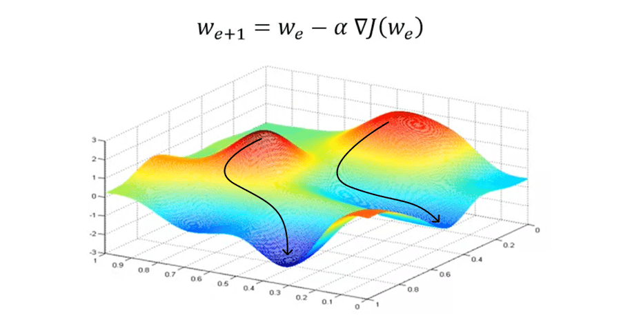
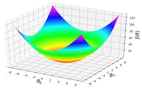

Flow of Supervised Learing

    Training set
        |
        | (data feeded to)
        |
    Learing algorithms
        |
        | (job of l_a is to )
        |
    hypothesis(h)
    output the function to make prediction, lets call this as hypothesis(h)

House prediction data:

| Size(feet^2) | price ($1000s) |
| :----------- | -------------: |
|     2104     |     400        |
|     1416     |      232       |
|     1534     |      315       |
|     852      |      178       |
|     .        |      .         |
|     .        |      .         |
|     .        |      .         |

how to represent the hypothesis?

$$ h(x) = \theta + \theta_1*X $$
h(x) --> input size x

$\theta (output) $

the equation explains,
for the given input of size X, the output number as linear function of the size X.

House prediction data after adding no_of_bedrooms:

| Size(feet^2) | no_of_bedrooms | price ($1000s) |
| :----------- | :------------: | -------------: |
|     2104     |       3        |      400       |
|     1416     |       2        |      232       |
|     1534     |       3        |      315       |
|     852      |       2        |      178       |
|     .        |       .        |      .         |
|     .        |       .        |      .         |
|     .        |       .        |      .         |

now the hypothesis will be,

$$ h(x) = \theta + \theta_1 * X_1 + \theta_2 * X_2 $$
$ X_1 -> size $

$ X_2 -> noofbedrooms $

In order to simplify the notation, we can write the hypothesis as 

$$ \sum_{j=0}^n (\theta_j * Xj) $$

where $X\theta$ = 1, n= no of features

$\theta = [ \theta_0
        \theta_1
        \theta_2]$

X = [ X0   -> always 1
        X1   -> size
        X2]  -> no_of_bedrooms

O = "parameters" (of the learning algorithmns, job of the learing algorithm is to choose parameters theta(O) that allows you to make a good predictions about the prices of houses)

m = "no of training examples" (no. of rows in table above)

X = "inputs" (features)

y = "output" (target variable)

(x, y) = one training example

(xi, yi) = ith training example

n = no of features(2)

how to choose parameters data?
    
lets, choose $\theta $ such that h(x) ≈ y for the training examples.
we can denote $h_\theta$(x) as h(x) 

$$ \tfrac{1}{2} \sum_{i=1}^m (h_\theta(x^i) - y^i)^2 $$

    here the 1/2 is included because, when we take derivatives to minimize this later, putting a one-half there would make some of the math little bit simpler

In linear regression we gonna define cost function J of Theta to be equal to that.

$$ 
J = \tfrac{1}{2} \sum_{i=1}^m (h_\theta(x^i) - y^i)^2 
$$

    J -> cost function of theta

we will find parameters data that minimizes the cost function J of theta

$ minimize_\theta J(\theta) $

## Gradient Descent

start with some value of $\theta (say \theta = \vec{O}) $

$\theta $ is a 3 dimenensional vector, here $ \vec{0} $ represent all the values are zero.

keep changing $\theta$ to reduce $J(\theta)$ 

So, in this diagram the horizontal axes are $ \theta_0 $ and $ \theta_1 $, output data is 3 dimensional we cant plot this, so i am just using  $ \theta_0 $ and $ \theta_1 $. 

but what you want to do is find values for $ \theta_0 $ and $ \theta_1 $, which minimizes the height of the surface

What gradient descent will do?
    
select any random point on the surface, gradient descent will look around all the 360°, and will find the best direction to should you take a little step to go downhill as fast as possible becaue we are trying to go downhill which will go to lowest possible elevation(goes to the lowest possible point of J($\theta $)) and then repeat untill you get the local optimum.

One property of gradient descent, depend on where you initialize parameters, you can get local diff-different points

when you run gradient descent on linear regression it turns out that, there will not be optimum.

lets formalize the gradient descent algorithm

one step of gradient descent can be implemented as,

$$ \theta_j := \theta_j - \alpha * (\frac{2}{2\theta_j}) * J(\theta) $$

here := means the value from from right is assigned to variable on left, its not equal

$ \alpha $ --> learning rate

$ (\frac{2}{2\theta_j}) $ --> this is partiall derivate of the cost function $ J(\theta)$ with respect to $\theta_j$

where j represent 0 to n the number of feature here we have 2 features which respresent (j = 0, 1, 2)

    derivative of a function defines the direction of steepest descent. so it defines the direction that allows you to go downhill as steepy as possible

$$ (\frac{2}{2\theta_j}) * J(\theta) = (\frac{2}{2\theta_j}) * \frac{1}{2} * (h_\theta (x) - y)^2 $$

after taking derivative

$$ 2 * \frac{1}{2} * (h_\theta (x) - y) * (\frac{2}{2\theta_j}) * (h_\theta (x) - y)  $$

$$ (h_\theta (x) - y) * (\frac{2}{2\theta_j}) * (h_\theta (x) - y)  $$

$$ (h_\theta (x) - y) * (\frac{2}{2\theta_j}) * (\theta + \theta_1 * X_1 +.....+ \theta_n * X_n - y)  $$

where h(x) = $ \theta + \theta_1 * X_1 +.....+ \theta_n * X_n $

here the partial derivate of the $\theta_j $ will be $ X_j $

eg., if j = 1

the paritially derivate of this value will be dependent only on $\theta_1$ rest all are 0, vice versa

so the equation will become,

$$ (h_\theta (x) - y) * X_j $$

now, 

$$ (\frac{2}{2\theta_j}) * J(\theta) = (h_\theta (x) - y) * X_j $$

$$ \theta_j := \theta_j - \alpha * \sum_{i=1}^m (h_\theta (x)^i - y^i) * X_j^i$$

the gradient descent algorithm is repeat the about equation untill convergence

this gradient descent calculates this derivates by summing over your entire training set m. and sometime this version of gradient descent is called batch gradient descent.

if gradient descent needs hundreds of iterations to converge, then it need to scan your entire dataset hundred times, it will take more time for larger data's.

There is an alternative to batch gradient descent. 

Stochastic gradient descent
    Repeat {

        for i = 1 to m {

$$ \theta_j := \theta_j - \alpha * \sum_{i=1}^m (h_\theta (x)^i - y^i) * X_j^i$$

        }

    }

the parameters will oscillate and wont ever quite converge because you're always running around looking at different houses and trying to do better than just one house, and that one hour and that one house.

when your dataset is large Stochastic gradient descent allows your implementation(algorithm) to make fater progress. it slowly increases learning rate. it will not reach the global minimum but atleast closer to global minimum

### when you stop Stochastic gradient descent

    for each step plot the j(cost function) of $ \theta $ and monitor it as it going down over the time. when it looks like stop going down then you can stop training.

One nice thing about linear regression is it have no global optimum. 

$$
\nabla_\theta J(\theta) = 
\begin{bmatrix}
\frac{\partial J}{\partial \theta_0} \\
\frac{\partial J}{\partial \theta_1} \\
\frac{\partial J}{\partial \theta_2}
\end{bmatrix}
$$
$$ \theta \in  \mathbb{R}$$

Let say A is 2x2 matrix

$$
A = 
\begin{bmatrix}
A_{11} & A_{12} \\
A_{21} & A_{22} \\
\end{bmatrix}
$$

$$ f(A) = A_{11} + A_{12}^2 $$

$$
A = 
f(
\begin{bmatrix}
5 & 6 \\
7 & 8 \\
\end{bmatrix})
= 5 + 6^2
$$

$$
\nabla_A f(A) = 
\begin{bmatrix}
\frac{\partial J}{\partial A_{11}} & \frac{\partial J}{\partial A_{12}} \\
\frac{\partial J}{\partial A_{21}} & \frac{\partial J}{\partial A_{22}} \\
\end{bmatrix}
$$

derivative of f(A) with respect to 1
$$
\nabla_A f(A) = 
\begin{bmatrix}
1 & 2*A_{12} \\
0 & 0 \\
\end{bmatrix}
$$

Gradient Descent

    Gradient descent is an iterative optimization algorithm, crucial in machine learning, that finds the minimum of a function (like a cost/loss function) by repeatedly taking steps in the opposite direction of the gradient (steepest descent), adjusting model parameters (weights/biases) to reduce errors and improve accuracy until convergence. Think of it as a blindfolded person descending a hill by feeling for the steepest downward slope and taking small steps until reaching the bottom (minimum)

### How it works:

    1. Start with guesses: Begin with random values for model parameters (weights, biases).

    2. Calculate the gradient: Compute the gradient (slope) of the cost function, which indicates the direction of steepest increase.

    3. Move downhill: Update parameters by moving in the opposite direction of the gradient (steepest decrease), scaled by a learning rate (step size).

    4. Repeat: Continue steps 2 and 3 until the cost function stops significantly decreasing, meaning the model has found optimal parameters. 

### Key Concepts:
    
    Cost Function: Measures model error (e.g., Mean Squared Error).

    Gradient: A vector showing the direction of the function's steepest ascent; its negative points to the steepest descent.

    Learning Rate: Controls the size of steps taken; too large, it overshoots; too small, training takes too long.

    Convergence: When the algorithm reaches a point (local or global minimum) where further steps don't reduce the cost much

