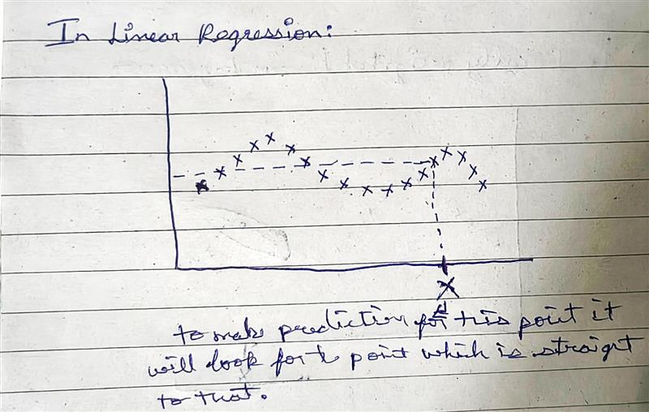
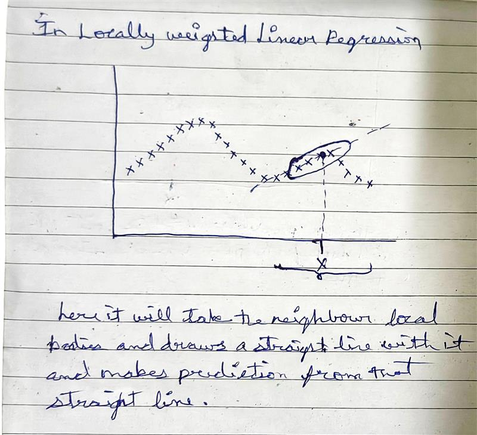
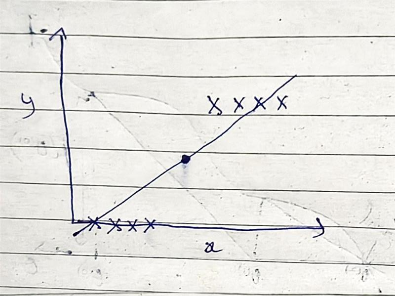
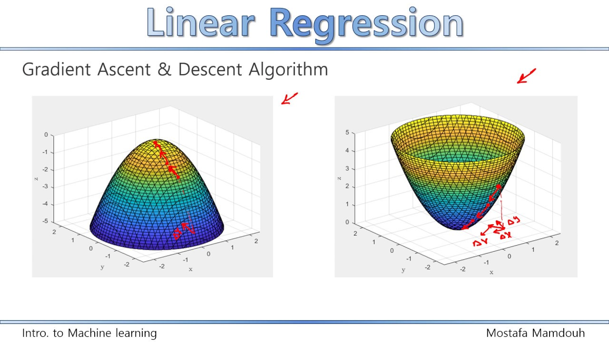
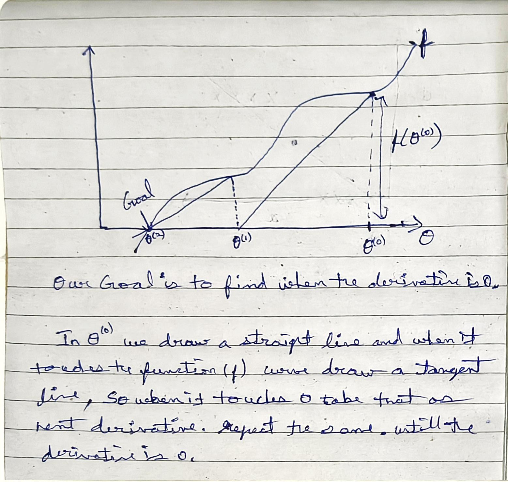

previously we saw that linear regression formula for a straight line

$$ h_\theta(x) = \theta_0 + \theta_1 * X_1 + \theta_2 * X_2 $$

what if the data doesnt fit in the straight line

if its curve then, 

$$ \theta_0 + \theta_1 * X_1 + \theta_2 * X_2^2 $$

or 

$$ \theta_0 + \theta_1 * X_1 + \theta_2 * \sqrt[2]{X_2}  $$

Feature selection algorithmns, which is a type of algorithm automattically deciding do we want x squared as a feature or square root of x as a feature or you want log(x) as a feature, but we set the feature does the best job fitting the data that you have.

different ways of addressing whether the data isn't just fit well by a straight line and in particular i wanna share with you an idea called locally weighted regression or locally weighted linear regression.

## Locally weighted regression

In ML, sometime we distinguish between parametric learning algorithms and non parametric algorithms

In "parametric" learning algorithmns, you fit some fixed set of parameters such as ($\theta_i$) to data. linear regression algorithm which fits a straight line is also a parametric learning algorithms

"Non-parametric" learning algorithm, eg., locally weighted regression, means the amount of data / parameters you need to keep grows(it grouws linearly) with the size of data, size of dataset given.

for linear regression if you want to evaluate h at certain value of X(input):

For LR: you will fit $\theta$ to minimize the cost function

$$ \frac{1}{2} \sum_{i}(y^i * \theta_x^{T(i)})^2 $$

you will return $\theta_x^T$

for locally weighted regression, you do something slightly different

fit $\theta$ to minimize the cost function

$$ \sum_{i=1}^m w^{(i)} (y^{(i)} * \theta_x^{T(i)} )^2  $$

where $w^{(i)}$ is a "weight" function

$$ w^{(i)} = exp(\frac{-(X^{(i)} - x)^2}{2}) $$

x is the location where you want to make prediction

$X^{(i)}$ is the input for your $i^{th}$ training example

$w^{(i)}$ is the weighting function that's a value between 0 and 1 that tells you how much should you pay attention to the values of $ (X^i, y^i) $ when fitting say this green line or that red line.

The above formula has defining property, 

if $ (X^{(i)} - x)$ is small, then $w^{(i)} \approx 1$

if $ (X^{(i)} - x)$ is large, then $w^{(i)} \approx 0$

how do we choose the width of the points need to fit a line in it.

    τ --> bandwith 

this will decide the width need to be taken

now the formula will rewritten as,

$$ w^{(i)} = exp(\frac{-(X^{(i)} - x)^2}{2*τ^2}) $$

τ will have the effect on overfitting and underfitting, 

locally weighted linear regression is usually not greater than extrapolation, but most many learning algorithmns are not good at extrapolation.

when can we use locally weighted linear regression?

    if you have a relatively low dimensional dataset, when the number of features is not too big. so when n is quite small 2 or 3 or something and when we have a lot of data. And you don't wanna think about the features to use.

## why least squares or square errors?

Assume,

$$ y^{(i)} = \theta_X^{T(i)} + \epsilon^{(i)}$$

$\epsilon$ --> "Error" that includes unmodeled effects and just some random noise

epsilon i is distributed gaussian would mean 0 and co-variance sigma squared

    εi​∼N(0,σ2)

Choosing the value of $\theta$ to minimize the least squre errors, thats like finding the maximum likelihood estimate for te parameters $\theta$ under this set of assumption we made that the error terms are Gaussian and IID (Independent and Identically Distributed.)

## classification

y $\in$ {0,1} (binary classification)

For classification problems linear regression wont give good results

because see the above image, LR will fit as straight line to the data and then take the straight line and therhold it at 0.5 and then say if its above 0.5 round it off to 1, if below 0.5 round it off to 0. 

## Logistic regression

want $ h_\theta (x) \in [0, 1]$

$$ h_\theta (x) = g(\theta^T x) = \frac{1}{1+e^{\theta_x^T}} $$

Sigmoid or logistic function

$$ g(z) = \frac{1}{1+e^{-z}} $$

P(y=1 | x; $\theta$) = $h_\theta(x)$

P(y=0 | x; $\theta$) = $1- h_\theta(x)$

y $\in$ {0,1}

Simplied one,

P(y | x; $\theta$) = $h(x)^y (1- h_\theta(x))^{1-y}$

if y = 1,

$ (1- h_\theta(x))^{1-1} $ = 1

so, 

P(y | x; $\theta$) = $h(x)^y$

if y = 0,

$h(x)^0$ = 1

so, 

P(y | x; $\theta$) = $ (1- h_\theta(x))^{1-1} $

here,

choose $\theta$ to maximize l($\theta\$), for this we will use batch gradient ascent 

logistic regression uses log likelihood

one step of gradient ascent can be implemented as,

$$ \theta_j := \theta_j + \alpha * (\frac{2}{2\theta_j}) * J(\theta) $$

here the function is maximized

while gradient descent

$$ \theta_j := \theta_j - \alpha * (\frac{2}{2\theta_j}) * J(\theta) $$

here the function is minimized

## Netwons method

In gradient ascent the algorithm takes a very small baby step, to take a bigger step we use newton's method

Have f

want to find $\theta$

such that f($\theta$) = 0

Newton method enjoys a property called "quadratic convergence"

"quadratic convergence" --> if one iteration newton's method has 0.01 error on the x-axis, after one iteration the error can go to 0.0001 error, after two iteration the error can go to 0.0000001 error

when you get near the minimum newton method converges extreme rapidly, after single iterations it become more accurate.

when $\theta$ is a vector, then the generalization of the rule

hessian matrix is matrix of partial derivates

for large dimensional matrix newton method is so expensive uses more computing power, so when the parameters are more than 10000 use gradient descent if it is less than go with newtons method